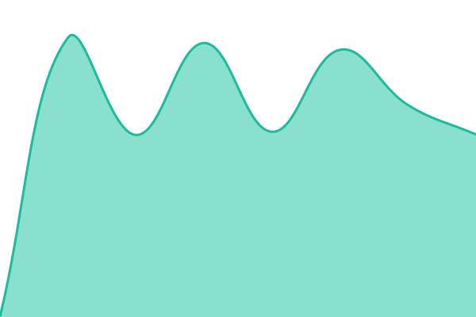
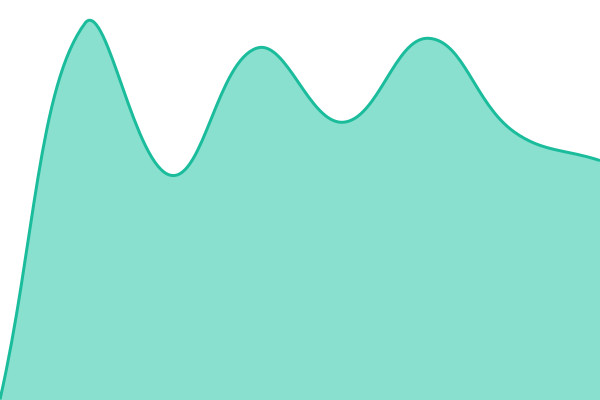

# [CognitionSync Status](https://status.cognitionsync.com): <!--live status--> **🟩 All systems operational**

Uptime monitoring for CognitionSync and our products. Checks run every five
minutes from GitHub Actions, independently of our own servers.

<!--start: status pages-->
<!-- This summary is generated by Upptime (https://github.com/upptime/upptime) -->
<!-- Do not edit this manually, your changes will be overwritten -->
<!-- prettier-ignore -->
| URL | Status | History | Response Time | Uptime |
| --- | ------ | ------- | ------------- | ------ |
|  [CognitionSync](https://cognitionsync.com) | 🟩 Up | [cognition-sync.yml](https://github.com/cognitionsync/uptime/commits/HEAD/history/cognition-sync.yml) | 

 646ms
     
 | 

<a href="https://status.cognitionsync.com/history/cognition-sync">100.00%</a>
    

|  [AxiomSquare](https://axiomsquarepk.com) | 🟩 Up | [axiom-square.yml](https://github.com/cognitionsync/uptime/commits/HEAD/history/axiom-square.yml) | 

 663ms
     
 | 

<a href="https://status.cognitionsync.com/history/axiom-square">100.00%</a>
    

|  [AxiomSquare Guides](https://axiomsquarepk.com/guides/) | 🟩 Up | [axiom-square-guides.yml](https://github.com/cognitionsync/uptime/commits/HEAD/history/axiom-square-guides.yml) | 

 646ms
     
 | 

<a href="https://status.cognitionsync.com/history/axiom-square-guides">100.00%</a>
    

|  [AxiomSquare Tools](https://axiomsquarepk.com/tools/) | 🟩 Up | [axiom-square-tools.yml](https://github.com/cognitionsync/uptime/commits/HEAD/history/axiom-square-tools.yml) | 

 575ms
     
 | 

<a href="https://status.cognitionsync.com/history/axiom-square-tools">100.00%</a>
    

|  [AxiomSquare API](https://axiomsquarepk.com/api/) | 🟩 Up | [axiom-square-api.yml](https://github.com/cognitionsync/uptime/commits/HEAD/history/axiom-square-api.yml) | 

 455ms
     
 | 

<a href="https://status.cognitionsync.com/history/axiom-square-api">100.00%</a>
    

|  [PraTax](https://pra.axiomsquarepk.com) | 🟩 Up | [pra-tax.yml](https://github.com/cognitionsync/uptime/commits/HEAD/history/pra-tax.yml) | 

 402ms
     
 | 

<a href="https://status.cognitionsync.com/history/pra-tax">100.00%</a>
    

|  [PraTax API](https://pra.axiomsquarepk.com/api/) | 🟩 Up | [pra-tax-api.yml](https://github.com/cognitionsync/uptime/commits/HEAD/history/pra-tax-api.yml) | 

 371ms
     
 | 

<a href="https://status.cognitionsync.com/history/pra-tax-api">100.00%</a>
    

|  [BuildingMall](https://buildingmall.cognitionsync.com) | 🟩 Up | [building-mall.yml](https://github.com/cognitionsync/uptime/commits/HEAD/history/building-mall.yml) | 

 561ms
     
 | 

<a href="https://status.cognitionsync.com/history/building-mall">100.00%</a>
    

|  [BuildingMall Materials](https://buildingmall.cognitionsync.com/materials) | 🟩 Up | [building-mall-materials.yml](https://github.com/cognitionsync/uptime/commits/HEAD/history/building-mall-materials.yml) | 

 485ms
     
 | 

<a href="https://status.cognitionsync.com/history/building-mall-materials">100.00%</a>
    

|  [CognitionSync Labs](https://demos.cognitionsync.com) | 🟩 Up | [cognition-sync-labs.yml](https://github.com/cognitionsync/uptime/commits/HEAD/history/cognition-sync-labs.yml) | 

 514ms
     
 | 

<a href="https://status.cognitionsync.com/history/cognition-sync-labs">100.00%</a>
    

|  [Quarlux Portfolio](https://demos.cognitionsync.com/quarlux/) | 🟩 Up | [quarlux-portfolio.yml](https://github.com/cognitionsync/uptime/commits/HEAD/history/quarlux-portfolio.yml) | 

 513ms
     
 | 

<a href="https://status.cognitionsync.com/history/quarlux-portfolio">100.00%</a>
    

|  [DocuMind Landing](https://demos.cognitionsync.com/documind/) | 🟩 Up | [docu-mind-landing.yml](https://github.com/cognitionsync/uptime/commits/HEAD/history/docu-mind-landing.yml) | 

 478ms
     
 | 

<a href="https://status.cognitionsync.com/history/docu-mind-landing">100.00%</a>
    

|  [Quarlux Power Control](https://quarlux-ai.cognitionsync.com) | 🟩 Up | [quarlux-power-control.yml](https://github.com/cognitionsync/uptime/commits/HEAD/history/quarlux-power-control.yml) | 

 522ms
     
 | 

<a href="https://status.cognitionsync.com/history/quarlux-power-control">100.00%</a>
    

|  [DocuMind](https://documind.cognitionsync.com) | 🟩 Up | [docu-mind.yml](https://github.com/cognitionsync/uptime/commits/HEAD/history/docu-mind.yml) | 

 394ms
     
 | 

<a href="https://status.cognitionsync.com/history/docu-mind">100.00%</a>
    

|  [csfunnel](https://csfunnel.cognitionsync.com) | 🟩 Up | [csfunnel.yml](https://github.com/cognitionsync/uptime/commits/HEAD/history/csfunnel.yml) | 

 551ms
     
 | 

<a href="https://status.cognitionsync.com/history/csfunnel">100.00%</a>
    

|  [RISC-V Jobs](https://allriscvjobs.cognitionsync.com) | 🟩 Up | [risc-v-jobs.yml](https://github.com/cognitionsync/uptime/commits/HEAD/history/risc-v-jobs.yml) | 

 817ms
     
 | 

<a href="https://status.cognitionsync.com/history/risc-v-jobs">100.00%</a>
    

|  [RISC-V Jobs Listings](https://allriscvjobs.cognitionsync.com/jobs) | 🟩 Up | [risc-v-jobs-listings.yml](https://github.com/cognitionsync/uptime/commits/HEAD/history/risc-v-jobs-listings.yml) | 

 610ms
     
 | 

<a href="https://status.cognitionsync.com/history/risc-v-jobs-listings">100.00%</a>
    

|  [CognitionSync (www)](https://www.cognitionsync.com) | 🟩 Up | [cognition-sync-www.yml](https://github.com/cognitionsync/uptime/commits/HEAD/history/cognition-sync-www.yml) | 

 925ms
     
 | 

<a href="https://status.cognitionsync.com/history/cognition-sync-www">100.00%</a>
    

|  [AxiomSquare (www)](https://www.axiomsquarepk.com) | 🟩 Up | [axiom-square-www.yml](https://github.com/cognitionsync/uptime/commits/HEAD/history/axiom-square-www.yml) | 

 1008ms
     
 | 

<a href="https://status.cognitionsync.com/history/axiom-square-www">100.00%</a>
    

|  [AxiomSquare (old subdomain)](https://axiomsquare.cognitionsync.com) | 🟩 Up | [axiom-square-old-subdomain.yml](https://github.com/cognitionsync/uptime/commits/HEAD/history/axiom-square-old-subdomain.yml) | 

 1034ms
     
 | 

<a href="https://status.cognitionsync.com/history/axiom-square-old-subdomain">100.00%</a>
    

|  [PraTax (old subdomain)](https://pra.axiomsquare.cognitionsync.com) | 🟩 Up | [pra-tax-old-subdomain.yml](https://github.com/cognitionsync/uptime/commits/HEAD/history/pra-tax-old-subdomain.yml) | 

 724ms
     
 | 

<a href="https://status.cognitionsync.com/history/pra-tax-old-subdomain">100.00%</a>
    

|  [Akif Ejaz](https://akifejaz.dev) | 🟩 Up | [akif-ejaz.yml](https://github.com/cognitionsync/uptime/commits/HEAD/history/akif-ejaz.yml) | 

 148ms
     
 | 

<a href="https://status.cognitionsync.com/history/akif-ejaz">100.00%</a>
    

<!--end: status pages-->

Incidents are filed as [issues](https://github.com/cognitionsync/uptime/issues).
Configuration lives in `.upptimerc.yml`; the workflow files are generated from it
and should not be edited directly.

[cognitionsync.com](https://cognitionsync.com) · Powered by [Upptime](https://upptime.js.org) (MIT)
