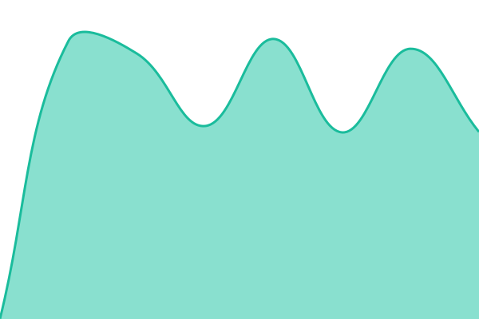

# [CognitionSync Status](https://cognitionsync.github.io/uptime): <!--live status--> **🟩 All systems operational**

Uptime monitoring for CognitionSync and our products. Checks run every five
minutes from GitHub Actions, independently of our own servers.

<!--start: status pages-->
<!-- This summary is generated by Upptime (https://github.com/upptime/upptime) -->
<!-- Do not edit this manually, your changes will be overwritten -->
<!-- prettier-ignore -->
| URL | Status | History | Response Time | Uptime |
| --- | ------ | ------- | ------------- | ------ |
|  [CognitionSync](https://cognitionsync.com) | 🟩 Up | [cognition-sync.yml](https://github.com/cognitionsync/uptime/commits/HEAD/history/cognition-sync.yml) | 

 446ms
     
 | 

<a href="https://cognitionsync.github.io/uptime/history/cognition-sync">100.00%</a>
    

|  [CognitionSync (www)](https://www.cognitionsync.com) | 🟩 Up | [cognition-sync-www.yml](https://github.com/cognitionsync/uptime/commits/HEAD/history/cognition-sync-www.yml) | 

 849ms
     
 | 

<a href="https://cognitionsync.github.io/uptime/history/cognition-sync-www">100.00%</a>
    

|  [AxiomSquare](https://axiomsquare.cognitionsync.com) | 🟩 Up | [axiom-square.yml](https://github.com/cognitionsync/uptime/commits/HEAD/history/axiom-square.yml) | 

 764ms
     
 | 

<a href="https://cognitionsync.github.io/uptime/history/axiom-square">100.00%</a>
    

|  [AxiomSquare Guides](https://axiomsquare.cognitionsync.com/guides/) | 🟩 Up | [axiom-square-guides.yml](https://github.com/cognitionsync/uptime/commits/HEAD/history/axiom-square-guides.yml) | 

 740ms
     
 | 

<a href="https://cognitionsync.github.io/uptime/history/axiom-square-guides">100.00%</a>
    

|  [PraTax](https://pra.axiomsquare.cognitionsync.com) | 🟩 Up | [pra-tax.yml](https://github.com/cognitionsync/uptime/commits/HEAD/history/pra-tax.yml) | 

 646ms
     
 | 

<a href="https://cognitionsync.github.io/uptime/history/pra-tax">100.00%</a>
    

|  [BuildingMall](https://buildingmall.cognitionsync.com) | 🟩 Up | [building-mall.yml](https://github.com/cognitionsync/uptime/commits/HEAD/history/building-mall.yml) | 

 566ms
     
 | 

<a href="https://cognitionsync.github.io/uptime/history/building-mall">100.00%</a>
    

|  [BuildingMall Materials](https://buildingmall.cognitionsync.com/materials) | 🟩 Up | [building-mall-materials.yml](https://github.com/cognitionsync/uptime/commits/HEAD/history/building-mall-materials.yml) | 

 511ms
     
 | 

<a href="https://cognitionsync.github.io/uptime/history/building-mall-materials">100.00%</a>
    

|  [CognitionSync Labs](https://demos.cognitionsync.com) | 🟩 Up | [cognition-sync-labs.yml](https://github.com/cognitionsync/uptime/commits/HEAD/history/cognition-sync-labs.yml) | 

 513ms
     
 | 

<a href="https://cognitionsync.github.io/uptime/history/cognition-sync-labs">100.00%</a>
    

|  [DocuMind](https://documind.cognitionsync.com) | 🟩 Up | [docu-mind.yml](https://github.com/cognitionsync/uptime/commits/HEAD/history/docu-mind.yml) | 

 505ms
     
 | 

<a href="https://cognitionsync.github.io/uptime/history/docu-mind">96.15%</a>
    

|  [Akif Ejaz](https://akifejaz.dev) | 🟩 Up | [akif-ejaz.yml](https://github.com/cognitionsync/uptime/commits/HEAD/history/akif-ejaz.yml) | 

 158ms
     
 | 

<a href="https://cognitionsync.github.io/uptime/history/akif-ejaz">100.00%</a>
    

<!--end: status pages-->

Incidents are filed as [issues](https://github.com/cognitionsync/uptime/issues).
Configuration lives in `.upptimerc.yml`; the workflow files are generated from it
and should not be edited directly.

[cognitionsync.com](https://cognitionsync.com) · Powered by [Upptime](https://upptime.js.org) (MIT)
